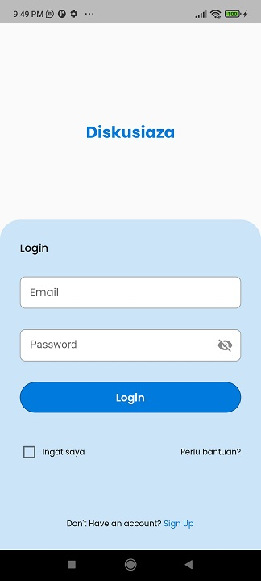
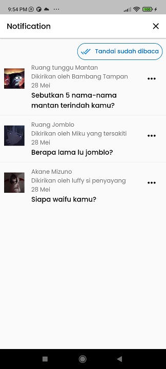
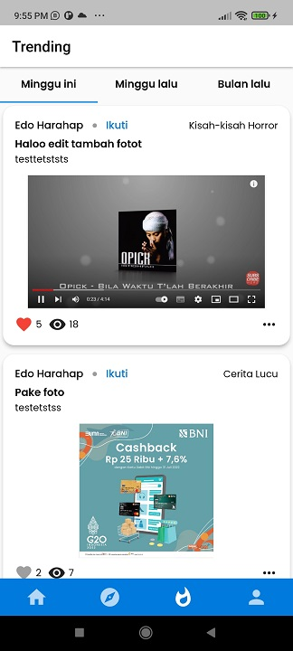
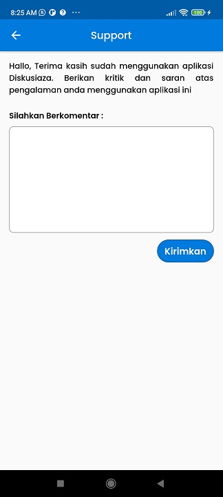

# Flutter-Diskusiaza
## Capstone Project Kelompok 32

Aplikasi Forum Group Discussion (FGD) mobile yang dikembangkan oleh kelompok 32 dengan menggunakan bahasa pemrograman Flutter.

## Link Download APK

## Fitur Singkat

Aplikasi ini ditujukan untuk memudahkan orang-orang yang ingin melakukan diskusi forum secara online.

## Package Yang Digunakan

- cupertino_icons: ^1.0.2
- google_fonts: ^3.0.1
- intl: ^0.17.0
- datetime_picker_formfield: ^2.0.0
- dio: ^4.0.6
- provider: ^6.0.3
- fluttertoast: ^8.0.9
- shared_preferences: ^2.0.15
- page_transition: ^2.0.9
- shimmer: ^2.0.0
- image_picker: ^0.8.5+3
- path: ^1.8.1

## Screenshot Aplikasi

### Splash Screen

### Login

### Register

### Home

### Notification

### Message

### Detail

### Post

### Explore

### Trending

### Profile Screen

### Profile detail

### Following

### Followers

### Edit Profile

### Bookmark

### Ruang

### Detail Ruang
.jpg)

### Kebijakan Privasi

### Support
