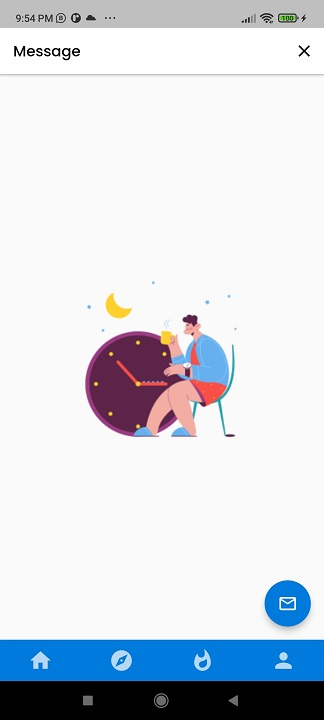
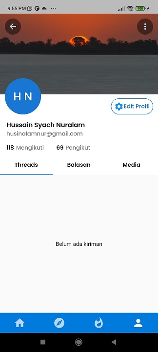
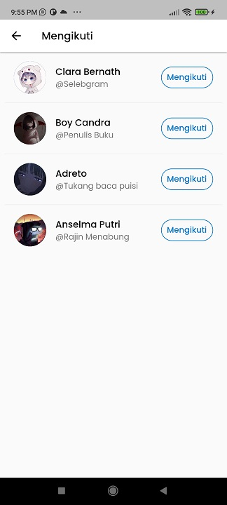

# Flutter-Diskusiaza
## Capstone Project Kelompok 32

Aplikasi Forum Group Discussion (FGD) mobile yang dikembangkan oleh kelompok 32 dengan menggunakan bahasa pemrograman Flutter.

## Link Download APK

## Fitur Singkat

Aplikasi ini ditujukan untuk memudahkan orang-orang yang ingin melakukan diskusi forum secara online.

## Package Yang Digunakan

- cupertino_icons: ^1.0.2
- google_fonts: ^3.0.1
- intl: ^0.17.0
- datetime_picker_formfield: ^2.0.0
- dio: ^4.0.6
- provider: ^6.0.3
- fluttertoast: ^8.0.9
- shared_preferences: ^2.0.15
- page_transition: ^2.0.9
- shimmer: ^2.0.0
- image_picker: ^0.8.5+3
- path: ^1.8.1

## Screenshot Aplikasi

### Splash Screen

>> merupakan laman pada aplikasi yang menampilkan logo aplikasi sebagai pembuka sebelum aplikasi terbuka.

### Login

>> merupakan laman pada aplikasi yang berfungsi untuk melakukan login akun pada aplikasi Diskusiaza.

### Register

>> merupakan laman pada aplikasi yang berfungsi untuk melakukan daftar akun pada aplikasi Diskusiaza apabila masih belum memiliki akun yang terdaftar.
### Home

>> merupakan laman pada aplikasi yang berfungsi sebagai halaman utama dari aplikasi Diskusiaza.
### Notification

>> merupakan laman pada aplikasi yang berfungsi untuk menunjukan notifikasi yang ada pada aplikasi Diskusiaza.
### Message

>> merupakan laman pada aplikasi yang berfungsi untuk media pesan pada aplikasi Diskusiaza.
### Detail

>> merupakan laman pada aplikasi yang berfungsi untuk menunjukan detail postingan yang ada pada aplikasi Diskusiaza.
### Post

>> merupakan laman pada aplikasi yang berfungsi untuk melakukan tindakan posting diskusi pada aplikasi Diskusiaza. Pada laman ini terdapat tujuan upload (publik/private), judul, isi, kategori, lampiran, dan tombol kirim.

### Explore

>> merupakan laman pada aplikasi yang berfungsi untuk menunjukan halaman pencarian pada aplikasi Diskusiaza.

### Trending

>> merupakan laman pada aplikasi yang berfungsi untuk menunjukan postingan diskusi apa yang sedang trending pada aplikasi Diskusiaza.

### Profile Screen

>> merupakan laman pada aplikasi yang berfungsi untuk menunjukan laman akun pada aplikasi Diskusiaza. Di dalam laman ini terdapat profile, bookmark, jawab, ruang, kebijakan privasi, rate us, dan logout.

### Profile detail

>> merupakan laman pada aplikasi yang berfungsi untuk menampilkan laman profil akun pada aplikasi Diskusiaza. Pada laman ini terdapat tab thread, balasan, dan media, dan button edit profil.

### Following

>> merupakan laman pada aplikasi yang berfungsi untuk menampilkan akun yang diikuti pada aplikasi Diskusiaza.

### Followers

>> merupakan laman pada aplikasi yang berfungsi untuk menampilkan akun yang mengikuti pada aplikasi Diskusiaza.

### Edit Profile

>> merupakan laman pada aplikasi yang berfungsi untuk melakukan edit profil akun pada aplikasi Diskusiaza.

### Bookmark

>> merupakan laman pada aplikasi yang berfungsi untuk menampilkan postingan diskusi yang telah dibookmark pada aplikasi Diskusiaza.

### Ruang

>> merupakan laman pada aplikasi yang berfungsi untuk menampilkan ruang diskusi apa saja yang diikuti dan disarankan pada aplikasi Diskusiaza.

### Detail Ruang
.jpg)
>> merupakan laman pada aplikasi yang berfungsi untuk menampilkan detail ruang diskusi pada aplikasi Diskusiaza.

### Kebijakan Privasi

>> merupakan laman pada aplikasi yang berfungsi untuk menampilkan kebijakan privasi pada aplikasi Diskusiaza. Di dalamnya juga terdapat button yang mengarahkan ke laman support atau pengaduan.

### Support

>> merupakan laman pada aplikasi yang berfungsi untuk melakukan pengaduan atau bantuan pada aplikasi Diskusiaza.